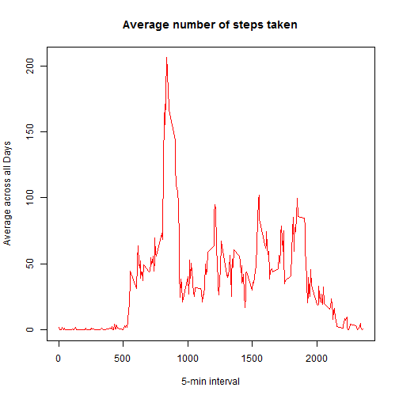
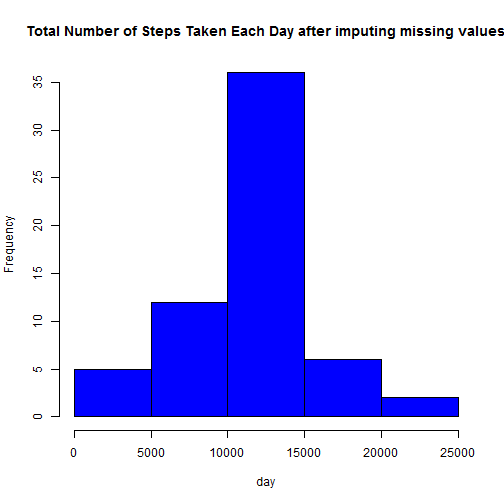

#Researcher:  Salil Vyas
## Research Project:  Analyzing data produced by personal activity monitoring device

 

###Introduction
It is now possible to collect a large amount of data about personal movement using activity monitoring devices such as a [Fitbit] (www.fitbit.com), [Nike Fuelband] (http://www.nike.com/us/en_us/c/nikeplus-fuel), or [Jawbone Up] (https://jawbone.com/). These type of devices are part of the "quantified self" movement - a group of enthusiasts who take measurements about themselves regularly to improve their health, to find patterns in their behavior, or because they are tech geeks. But these data remain under-utilized both because the raw data are hard to obtain and there is a lack of statistical methods and software for processing and interpreting the data.

This Analysys makes use of data from a personal activity monitoring device "Fitbit". This device collects data at 5 minute intervals through out the day. The data consists of two months of data from an anonymous individual collected during the months of October and November, 2012 and include the number of steps taken in 5 minute intervals each day.

###Data
The data for this assignment can be downloaded from the course web site:

Dataset: Activity monitoring data [52K]
The variables included in this dataset are:

1. steps: Number of steps taking in a 5-minute interval (missing values are coded as NA)

2. date: The date on which the measurement data was taken in YYYY-MM-DD format

3.  interval: Identifier for the 5-minute interval in which measurement was taken

The dataset is stored in a comma-separated-value (CSV) file and there are a total of 17,568 observations in this dataset.


###Load Lilbraries as needed


```r
#Load Lilbraries as needed
library(dplyr)
```

```
## Warning: package 'dplyr' was built under R version 3.1.3
```

```
## 
## Attaching package: 'dplyr'
## 
## The following object is masked from 'package:stats':
## 
##     filter
## 
## The following objects are masked from 'package:base':
## 
##     intersect, setdiff, setequal, union
```

```r
library(knitr)
library (lattice)
```

###Loading and preprocessing the data

```r
#set Working Directory
setwd ("C:/testR/labs-r/repres/PA1")

#Check and Read raw data file names activity.csv if not read already to save time and processing.

if(!exists("activity")){
  activity <- read.csv("activity.csv", colClasses = c("numeric", "character", "numeric"))
}
```


###Check the Activity data

```r
head(activity)
names(activity)
```


###What is mean total number of steps taken per day?

```r
# 1.   Calculate the total number of steps taken per day
per_day<-group_by(activity, date )
per_day<-(summarize(per_day, sum(steps))) #total number of steps per day
df_per_day <- data.frame(per_day)
names(df_per_day)
```

```
## [1] "date"       "sum.steps."
```


```r
# 2.   Histogram of the total number of steps taken each day
hist(df_per_day$sum.steps., main = "Total steps by day", xlab = "day", col = "blue")
```

 


```r
# 3.   Mean and median of the total number of steps taken per day
Mean <- mean(df_per_day$sum.steps., na.rm=TRUE)
Mean
```

```
## [1] 10766.19
```

```r
Median <- median(df_per_day$sum.steps., na.rm=TRUE)
Median
```

```
## [1] 10765
```

###What is the average daily activity pattern?

```r
#1 time series plot (i.e. type = "l") of the 5-minute interval (x-axis) and the average number of steps taken

per_int<-tapply(activity$steps, activity$interval, mean, na.rm=TRUE)

plot(row.names(per_int), per_int, type = "l", xlab = "5-min interval", 
     ylab = "Average across all Days", main = "Average number of steps taken", 
     col = "red")
```

 


```r
#2. Which 5-minute interval, on average across all the days in the dataset, contains the maximum number of steps?

summary(per_int)
```

```
##    Min. 1st Qu.  Median    Mean 3rd Qu.    Max. 
##   0.000   2.486  34.110  37.380  52.830 206.200
```

```r
max_steps<-which.max(per_int)

#the 5-minute interval that, on average, contains the maximum number of steps is
names(max_steps)
```

```
## [1] "835"
```

###Imputing missing values

```r
# 1. Calculate and report the total number of missing values in the dataset (i.e. the total number of rows with NAs)

activity_NA <- sum(is.na(activity))

activity_NA
```

```
## [1] 2304
```


```r
# 2. Devise a strategy for filling in all of the missing values in the dataset. 

Avg_Steps <- aggregate(steps~interval, data = activity, FUN=mean) #Calculate Average Steps by interval

Rep_NA<-numeric() #Replace NA values with Numeric value - Initiate

for (i in 1:nrow (activity)) {             
  obs<-activity[i, ]
  if (is.na (obs$steps)) {
    steps<-subset(Avg_Steps, interval == obs$interval)$steps   #If Steps=NA then replace the value with Average Steps for the interval
  } else {
      steps<-obs$steps
  }
  Rep_NA <- c(Rep_NA, steps)
}
```


```r
# 3. Create a new dataset that is equal to the original dataset but with missing data filled in

new_ds <-activity

new_ds$steps <-Rep_NA
```


```r
# 4. Make a histogram of the total number of steps taken each day and Calculate and report the mean and median total number of steps taken per day. 

Steps_Total <- aggregate(steps~date, data=new_ds, FUN=sum)

hist(Steps_Total$steps, col="blue", xlab="day", main="Total Number of Steps Taken Each Day after imputing missing values")
```

 

```r
#mean
mean(Steps_Total$steps)
```

```
## [1] 10766.19
```

```r
median(Steps_Total$steps)
```

```
## [1] 10766.19
```

### When the missing values are replaced by Average steps taken by interval, the mean and median values change as expected, but very slightely (fractionally) in our case.


###Are there differences in activity patterns between weekdays and weekends?

```r
# 1.  Create a new factor variable in the dataset with two levels - "weekday" and "weekend" indicating whether a given date is a weekday or weekend day.
activity$date <- as.Date(activity$date, "%Y-%m-%d")
days<-weekdays(activity$date)
daytype <- vector()

for (i in 1:nrow(activity)) {
    if (days[i] == "Sunday") {
        daytype[i] <- "Weekend"
    }
      else if (days[i] == "Saturday") {
        daytype[i] <- "Weekend"
    }
        
      else {
        daytype[i] <- "Weekday"
  }
}

activity$daytype <- daytype
activity$daytype <- factor(activity$daytype)


stepsByDay <- aggregate(steps ~ interval + daytype, data = activity, mean)
names(stepsByDay) <- c("interval", "daytype", "steps")
```


```r
#2. Make a panel plot containing a time series plot (i.e. type = "l") of the 5-minute interval (x-axis) and the average number of steps taken, averaged across all weekday days or weekend days (y-axis). See the README file in the GitHub repository to see an example of what this plot should look like using simulated data.
xyplot(steps ~ interval | daytype, stepsByDay, type = "l", layout = c(1, 2), 
    xlab = "Interval", ylab = "Number of steps")
```

 
